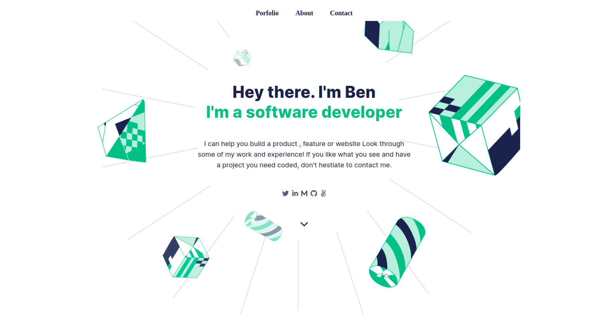
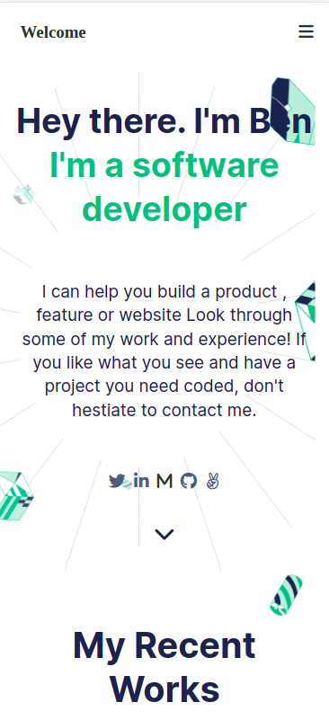

 

<h1 align="center"> My Portlio Website </h1>

> This is my personal portfolio that I will be updating as I build Projects. 
> Browse through my projects and reach out to me for any collaboration

## Built With

- HTML and CSS

## Getting Started

To get a local copy up and running follow these setup steps below.

### Setup

- Simply fork this project and it should be ready for you to edit as you see fit.
- In case you run into any errors please raise an [issue](https://github.com/Benmuiruri/my-portfolio/issues).

## Authors

👤 **Author**

- GitHub: [@githubhandle](https://github.com/Benmuiruri)
- Twitter: [@twitterhandle](https://twitter.com/_optimize)
- LinkedIn: [LinkedIn](https://www.linkedin.com/in/benjamin-kiarie-180b66149/)

## 🤝 Contributing

Contributions, issues, and feature requests are welcome!

Feel free to check the [issues page](https://github.com/Benmuiruri/my-portfolio/issues).

## Show your support

Give a ⭐️ if you like this project!

## Acknowledgments

- Huge thanks to [Didier Sangwa](https://github.com/sangwa7) for his contribution to the project

## 📝 License

This project is [MIT](https://opensource.org/licenses/MIT) licensed.
